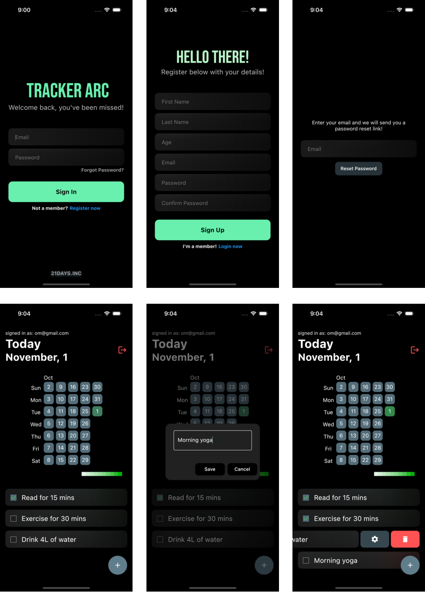

# Tracker Arc

A Habit-Tracking Application to assist users in keeping track of their daily habits.
(created as a part of IRIS Code-In 107 App Dev Task).

## Demo


## Screenshots



## Implemented Features

- User Login/Registration using [Firebase](https://firebase.google.com/).
- Local data storage using [HIVE](https://docs.hivedb.dev/#/).
- Monthly summary heat-map to analyse user consistency.
- Option to reset user password using forgot password.
- Cross platform.

## UI/UX Enhancements

- Implemented glassmorphism in the overall user-interface.
- Sliding actions to view more options for the habit tiles.
- Added Haptic Feedback throughout the app.

## Planned Features

- [ ] Authentication using various services like Google, Facebook and Apple.
- [ ] Clicking the heat map tiles shows the corresponding day’s tasks.
- [ ] Notification feature to remind users of the pending tasks for the day.
- [ ] Personalised welcome message for the users once they register with the app through email.
- [ ] Monthly habit tracker report as a mailing service.

## Planned UI/UX updates

- [ ] Animations and sounds to the app based on user interaction.
- [ ] Toggle light/dark mode.

## Known Bugs

- The app crashes if the SIGN-IN button is pressed twice accidentally.

## Operating System used

- MacOS

## Color Reference

-  `Primary Swatch Color: #607d8b`
-  `Primary Accent Color: #69f0ae`
-  `Secondary Accent Color: #ff5252`
-  `Background Color: #000000`

## Run Locally

Clone the project

```bash
  git clone https://github.com/rupnkrdas/IRIS_2022_Rupankar_Das_201ME148.git
```

Go to the project directory

```bash
  cd IRIS_2022_Rupankar_Das_201ME148
```

Install dependencies

```bash
  flutter pub get
```

Run the app

```bash
  flutter run
```

## Used Dependencies

- flutter_slidable: ^2.0.0
- hive: ^2.2.3
- hive_flutter: ^1.1.0
- flutter_heatmap_calendar: ^1.0.5
- glassmorphism: ^3.0.0
- intl: ^0.17.0
- google_fonts:
- firebase_auth: ^4.1.0
- cloud_firestore: ^4.0.3
- flutter_glow: ^0.2.0

## Authors

- [@rupnkrdas](https://www.github.com/rupnkrdas)

## Feedback

If you have any feedback, please reach out to us at rupnkr1512.das0007@gmail.com
